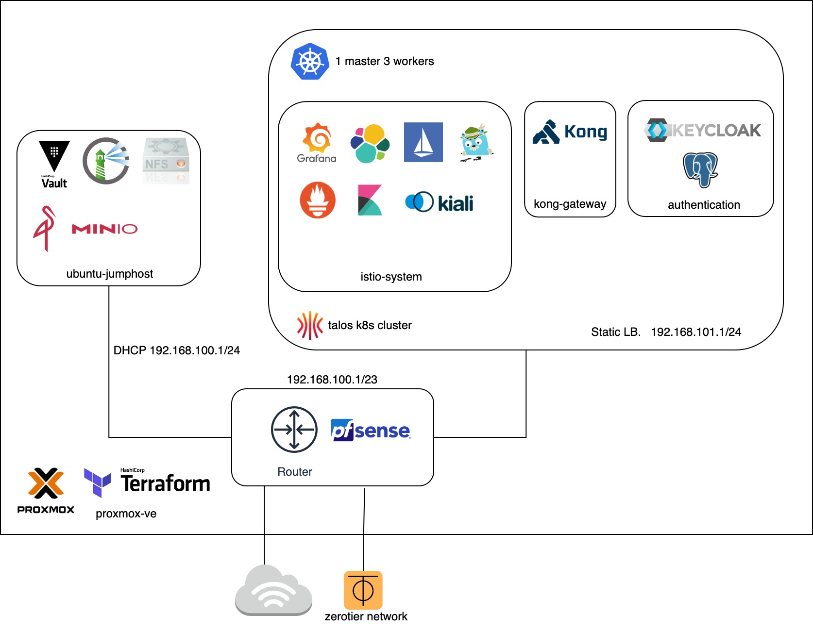
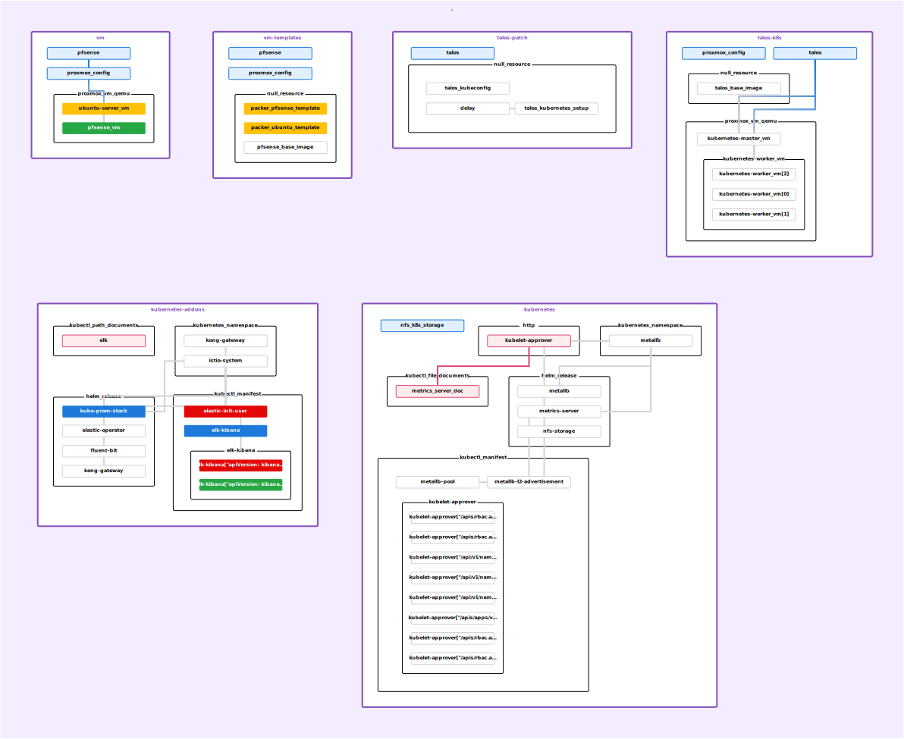

# home-server

[](https://github.com/guyzsarun/home-server/actions/workflows/main.yml) 
[](https://github.com/guyzsarun/home-server/actions/workflows/healthcheck.yml)

Proxmox Virtual Environment (Proxmox VE) for running VMs and Kubernetes Cluster provisioned using Terraform and Ansible.


## Table of Contents

- [Diagram](#home-server-diagram)
- [Product Structure](#project-structure)
- [OPNsense Router](#opnsense-router)
- [Jumphost VM](#jumphost-vm)
- [Kubernetes Cluster](#kubernetes-cluster)
  - [Authentication](#authentication)
  - [Service Mesh / API Gateway](#service-mesh-and-api-gateway)
- [Terraform Diagram](#terraform-diagram)


## Home server Diagram




## Project Structure
```
.
├── ansible                             # ansible playbook
├── kubernetes                          # kubernetes/ helm chart manifests
├── packer                              # packer vm templates
└── terraform                           # terraform iac
    └── _talos                          # talos kubernetes cluster config
    └── modules                         
        └── kubernetes                  # kubernetes cluster essentials
        └── kubernetes-addons           # kubernetes addons
        └── talos-k8s                   # talos kubernetes vm
        └── talos-patch                 # talos kubernetes vm patch
        └── vm                          # jumphost / router vm
        └── vm-templates                # vm templates
```


## OPNsense Router
OPNsense router with zerotier plugin for VPC

**Default Credentials**
- username: root
- password: opnsense

**Network Interface**
| Interface | Network | Description | IP |
|-----------|---------|-------------|----|
| LAN       | vtnet0  |  Linux Bridge | 192.168.0.1/24 |
| OPT       | vtnet1  |  VM Network | 172.16.0.0/16 |
| OPT1      | zt0     | Zerotier Network | - |

### OPNsense Plugin Setup
1. Update OPNsense to the latest version `System > Firmware > Updates`
2. Install `os-qemu-guest-agent` and `os-zerotier `
3. Join Zerotier Network `VPN > Zerotier > Join Network`
4. Setup Network Interface or Import from previous backup


## Jumphost VM

1. Update `ansible/hosts` with jumphost vm 

```
ubuntu-server ansible_host=x.x.x.x ansible_user=devops
```

2. Run the `install-server.yaml` playbook with tags for each service to enable

#### Available Service
- [Harbor](https://goharbor.io/) - Container registry
- [Minio](https://min.io/)  - S3 Compatible storage
- [Vault](https://www.hashicorp.com/products/vault)  - Secret management
- NFS server for Kubernetes Cluster
- [Zerotier](https://www.zerotier.com/) - Remote access to Jumphost
```
ansible-playbook install-server.yaml --list-tags

playbook: install-server.yaml

  play #1 (ubuntu-server): Install Server       TAGS: []
      TASK TAGS: [always, harbor, minio, nfs, vault, zerotier]
```


## Kubernetes Cluster
1. Provision [Talos](https://www.talos.dev/) Kubernetes vm

```
terraform -chdir=./terraform plan

terraform -chdir=./terraform apply -target module.talos-k8s
```
2. Update talos kubernetes master/worker ip in `terraform.tfvars` 
```
talos_master_ip = ""
talos_worker_ip = [ "" ]
```
3. Initialize/Patch Talos Kubernetes cluster

```
terraform -chdir=./terraform apply -target module.talos-patch
```
4. Apply Kubernetes cluster essentials ( metrics-server / loadbalancer / nfs storage provisioner )
```
terraform -chdir=./terraform apply -target module.kubernetes
```

5. Apply base kubernetes cluster config / addons
```
terraform -chdir=./terraform apply -target module.kubernetes-addons
```
### Authentication

Install keycloak OIDC with Postgresql
```
kubectl apply -f ./kubernetes/keycloak/keycloak.yaml
```
Keycloak client for application available in `./kubernetes/keycloak/client`

### Service Mesh and  API Gateway

Install Mesh components and Patch Kong UI
```
kubectl apply -f ./kubernetes/monitoring/kiali.yaml 
kubectl apply -f ./kubernetes/monitoring/jaeger.yaml 


kubectl patch svc/kong-gateway-kong-manager --patch-file=./kubernetes/kong/kong-patch.yaml
```

## Terraform Diagram

Generated using [rover](https://github.com/im2nguyen/rover)

